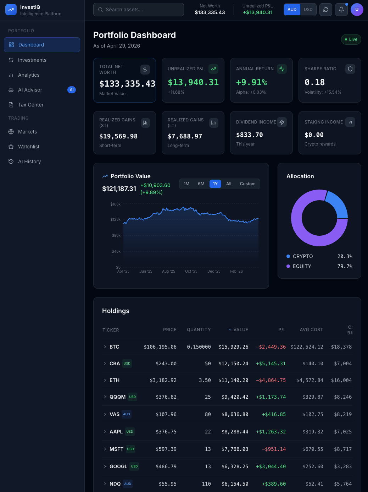
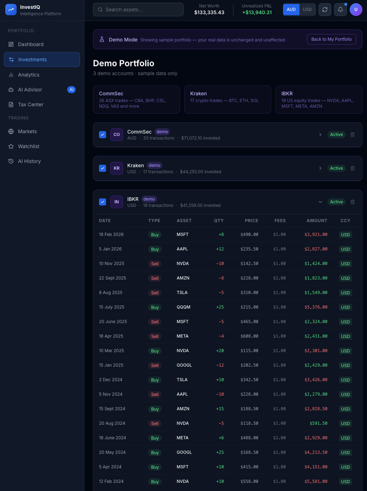
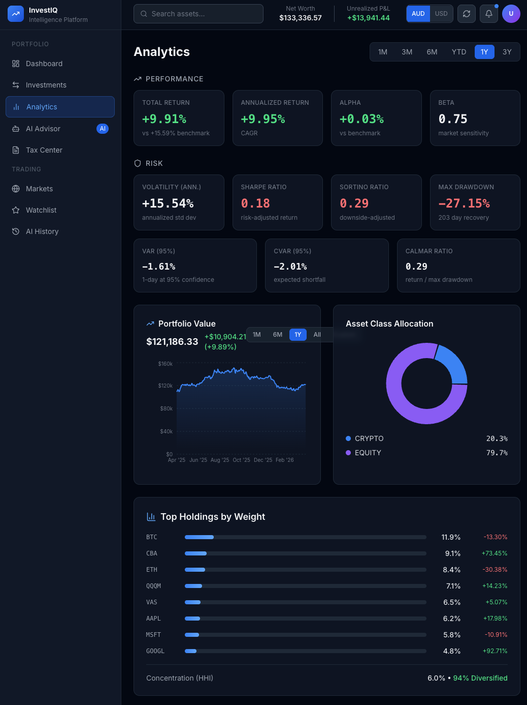
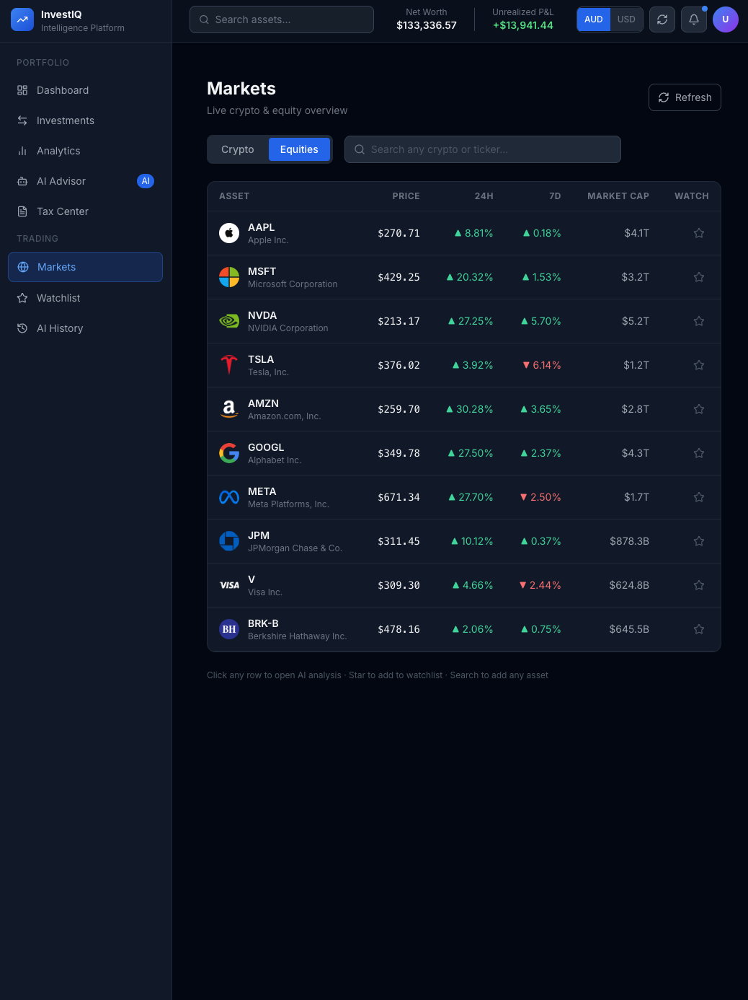
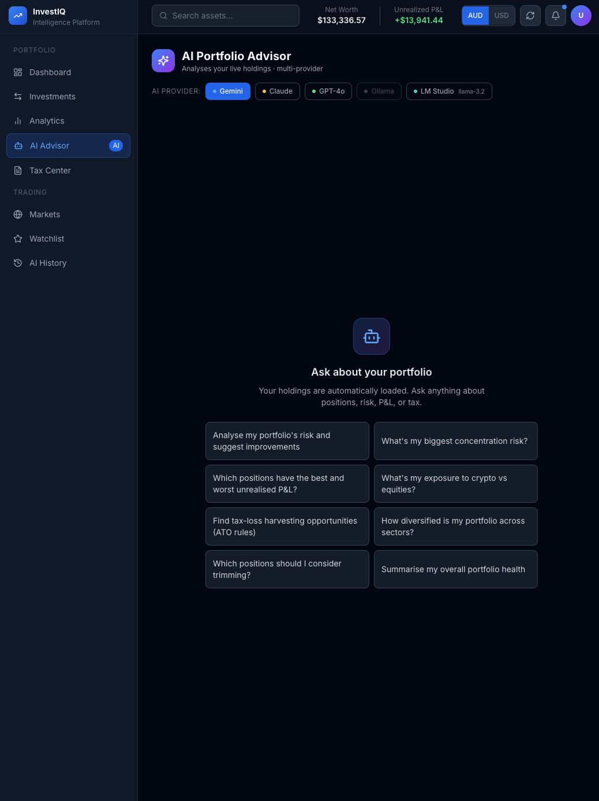

<div align="center">

# InvestIQ

**Self-hosted portfolio tracking for equities, ETFs, and crypto.**

[](https://python.org)
[](https://fastapi.tiangolo.com)
[](https://nextjs.org)
[](https://docker.com)
[](LICENSE)

</div>

InvestIQ helps you track investments across brokers and exchanges, convert mixed AUD/USD holdings correctly, review performance, estimate tax outcomes, and ask AI-assisted questions about your portfolio. It is built with Australian investors in mind, but works for global portfolios too.

## Features

- Import transactions from CommSec, Interactive Brokers, Kraken, Stake, CMC, MooMoo, and similar broker CSV exports.
- Track equities, ETFs, and crypto across multiple accounts.
- Toggle AUD/USD reporting with per-transaction FX handling.
- Review holdings, cost basis, unrealized P&L, dividends, staking income, and realized gains.
- Analyze performance, allocation, risk, drawdowns, and benchmark comparison.
- Use AI analysis and a portfolio advisor with Gemini, Claude, OpenAI, Ollama, or LM Studio.
- Run locally with Docker Compose, PostgreSQL, Redis, FastAPI, and Next.js.

## Screenshots

A quick look at the dashboard, transaction imports, analytics, markets, and AI portfolio advisor.

<p align="center">
  
</p>

| Transactions | Analytics |
|---|---|
|  |  |

| Markets | AI Advisor |
|---|---|
|  |  |

## Quick Start

Prerequisites: Docker and Docker Compose.

```bash
git clone https://github.com/miladtm94/Investment-Portfolio-Tracker
cd Investment-Portfolio-Tracker
cp .env.example .env
docker compose up -d
```

Open the app at [http://localhost:3000](http://localhost:3000).

The backend runs on [http://localhost:8010](http://localhost:8010) by default to avoid common local port conflicts.

Useful commands:

```bash
make serve         # start existing containers
make rebuild       # rebuild with Docker cache
make clean-rebuild # full no-cache rebuild
make logs          # follow container logs
make stop          # stop services
```

Minimum `.env` values:

```env
POSTGRES_DB=investment_platform
JWT_SECRET_KEY=change-me-min-32-chars
ENCRYPTION_KEY=32-char-string-here!!

# Optional: add at least one AI provider key
GEMINI_API_KEY=your-key
# or ANTHROPIC_API_KEY / OPENAI_API_KEY
```

## Broker Imports

| Source | Method | Notes |
|---|---|---|
| CommSec | CSV export | ASX equities and ETFs |
| Interactive Brokers | Flex Query / CSV | Global assets, dividends, cash transactions |
| Kraken | Trades CSV / API sync | Crypto, mainly USD quoted |
| Stake, CMC, MooMoo | CSV export | Auto-detected where supported |

Go to **Dashboard -> Transactions**, choose your broker, then upload the export file.

## Local AI

You can use local models without a hosted API key.

- **LM Studio:** start the Local Server in LM Studio. InvestIQ can connect to it automatically.
- **Ollama:** run `ollama serve`, then pull a model such as `ollama pull gemma3:4b`.

## Tech Stack

| Layer | Technology |
|---|---|
| Frontend | Next.js 15, TypeScript, Tailwind CSS, TanStack Query |
| Backend | Python 3.12, FastAPI, SQLAlchemy async |
| Data | PostgreSQL, Redis |
| Market Data | Yahoo Finance, CoinGecko, provider fallbacks |
| AI | Gemini, Claude, OpenAI, Ollama, LM Studio |
| DevOps | Docker Compose |

## Support

If this project saves you time, fuels your research, or helps you wrangle your portfolio, you can support it here:

[☕💛 Buy me a coffee](https://www.buymeacoffee.com/miladtm94)

## Disclaimer

This software is for informational and educational purposes only. It is not financial, tax, or investment advice. Always verify calculations independently and consult a licensed professional before making financial decisions.

## License

Released under the [MIT License](LICENSE).
